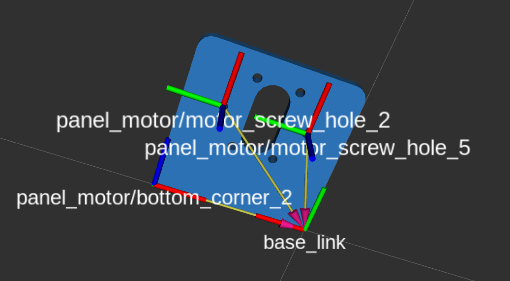
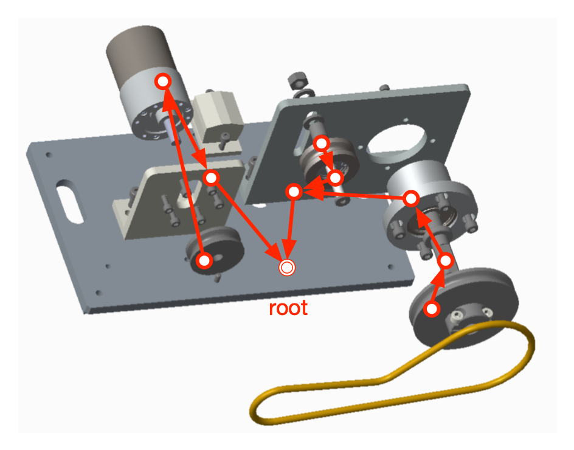
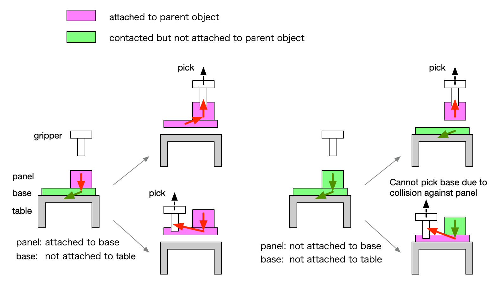
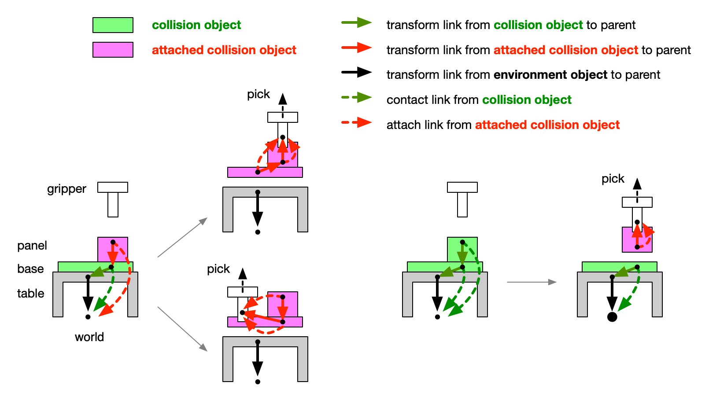

aist_collision_object_manager
==================================================

## 概要
本パッケージは，[MoveIt](https://github.com/moveit/moveit)の[PlanningSceneInterface](https://github.com/moveit/moveit/blob/master/moveit_commander/src/moveit_commander/planning_scene_interface.py)を通じて[CollisionObject](http://docs.ros.org/en/noetic/api/moveit_msgs/html/msg/CollisionObject.html)および[AttachedCollisionObject](http://docs.ros.org/en/noetic/api/moveit_msgs/html/msg/AttachedCollisionObject.html)を操作することにより，ロボットがハンドリングする物体の接触状態を管理する機能を提供する．

## CollisionObjectとAttachedCollisionObjectの振舞い
[CollisionObject](http://docs.ros.org/en/noetic/api/moveit_msgs/html/msg/CollisionObject.html)と[AttachedCollisionObject](http://docs.ros.org/en/noetic/api/moveit_msgs/html/msg/AttachedCollisionObject.html)は，次のように生成・消滅する．
- `CollisionObject`は，[add_object()](https://github.com/moveit/moveit/blob/88b386581c5f25cc5733585bd39dfd2ea690329b/moveit_commander/src/moveit_commander/planning_scene_interface.py#L98)によって生成される．
- `CollisionObject`に[attach_object()](https://github.com/moveit/moveit/blob/88b386581c5f25cc5733585bd39dfd2ea690329b/moveit_commander/src/moveit_commander/planning_scene_interface.py#L132)を適用すると`AttachedCollisionObject`に変容し，指定された`link`に接続される．`touch_links`を指定すれば，それも設定される(optional)．
- 既存の`AttachedCollisionObject`に対して`link`を指定せずに[attach_object()](https://github.com/moveit/moveit/blob/88b386581c5f25cc5733585bd39dfd2ea690329b/moveit_commander/src/moveit_commander/planning_scene_interface.py#L132)を適用すると，`touch_links`のみが設定される．
- `AttachedCollisionObject`に対して[remove_attached_object()](https://github.com/moveit/moveit/blob/88b386581c5f25cc5733585bd39dfd2ea690329b/moveit_commander/src/moveit_commander/planning_scene_interface.py#L197)を適用すると，リンクへの接続が解除され，このオブジェクトは`CollisionObject`に戻る．オブジェクトそのものが消滅するわけではない．
- `CollisionObject`に[remove_world_object()](https://github.com/moveit/moveit/blob/88b386581c5f25cc5733585bd39dfd2ea690329b/moveit_commander/src/moveit_commander/planning_scene_interface.py#L187)を適用すると，このオブジェクトが消滅する．

また，`PlanningSceneInterface`のAPIに関して，以下の点に注意が必要である．

- [add_object()](https://github.com/moveit/moveit/blob/88b386581c5f25cc5733585bd39dfd2ea690329b/moveit_commander/src/moveit_commander/planning_scene_interface.py#L98)によって生成される`CollisionObject`のポーズは，引数`collision_object`中の`header`と`pose`で指定される．`header.frame_id`には任意のフレームを指定できるが，生成後のポーズは`MoveIt`の`planning_frame`から見たものになる．すなわち，生成したオブジェクトの`id`を指定して[get_objects()](https://github.com/moveit/moveit/blob/88b386581c5f25cc5733585bd39dfd2ea690329b/moveit_commander/src/moveit_commander/planning_scene_interface.py#L242)を呼ぶと，返される`CollisionObject`の`header.frame_id`は`planning_frame`(例えば”world”)となり，`pose`もこのフレームから見た値になる．
- `CollisionObject`を別の`CollisionObject`や`AttachedCollisionObject`に接続することはできない．接続先のリンク(`attach_link`)は，`MoveIt`の起動時に`robot_description`から読み込まれるリンクツリーに含まれるものに限られる．
- [get_objects()](https://github.com/moveit/moveit/blob/88b386581c5f25cc5733585bd39dfd2ea690329b/moveit_commander/src/moveit_commander/planning_scene_interface.py#L242)は，`CollisionObject`のみを返し，`AttachedCollisionObject`を返さない．
- [get_attached_objects()](https://github.com/moveit/moveit/blob/88b386581c5f25cc5733585bd39dfd2ea690329b/moveit_commander/src/moveit_commander/planning_scene_interface.py#L254)は，`AttachedCollisionObject`のみを返し，`CollisionObject`を返さない．

## ハンドリング対象物体の表現
対象物体は[aist_descriptions/parts](../aist_description/parts)で用いられる形式に準拠して表現される．具体的には，YAMLファイル(例：[parts_properties.yaml](../aist_description/parts/config/parts_properties.yaml))によってその幾何形状，衝突形状，サブフレーム等が指定される．`collision_object_manager`は，起動時にこれを読み込んで全対象物体の情報を内部に保持する．

各サブフレームは，`MoveIt`から`<object ID>/<subframe name>`というフレーム名で見える．しかし，`MoveIt`の外部からは見えないので，`collision_object_manager`は，こ
れらを同名で`tf`にbroadcastすることによって，どこからでも見えるようにしている．

YAMLファイルに指定されたサブフレームの他に，対象物体はそのポーズを指定するためのフレームを持ち，`MoveIt`から`<object ID>/base_link`というフレーム名で見える．各サブフレームのポーズは，このフレームから見たものである．これも同名で`tf`にbroadcastされている．

## 組立作業における部品間の接触・接続関係の表現
製品組立作業においては，部品間の接触・接続関係や，把持したときの部品とグリッパの接続関係を表現し，組立中の製品の状態を追跡するとともに，それをアームの経路計画における干渉判定などに反映させる必要がある．

組立中の製品の状態は，製品を構成する部品をノードとし，部品間の接続をアークとする木構造で表現される．木構造なので，各部品は親となる部品を一つしか持たない．そのため，一つの部品が他の複数の部品に接続する場合は，前者を親とし，後者をその子とするように木構造を構成する．

また，木構造のrootは，製品が製品外のリンクと接触（作業台など）または接続（グリッパなど）している部品を表すノードになるように選ばれる．したがって，製品が作業台に置かれたりグリッパで把持されたりして外界との接触・接続関係が変わるたびに，それを反映して木構造も動的に変化する．

下図左の例では，panelはbaseに接続し，baseはtableに接触しており，後者が木構造のrootになっている．グリッパでbaseを把持すると，木構造はそのままでbaseがグリッパに接続される．一方，panelを把持した場合は，panelがrootになるよう木構造が変化してグリッパに接続される．いずれの場合もpanelとbaseが一体となってグリッパに持ち上げられる．

下図右の例では，panelはbaseと接触しているが接続はしていない．このときpanelを把持す
ると，panelのみグリッパに接続されて持ち上げられる．baseを把持すると，panelと干渉するため持ち上げることができない．

## CollisionObjectとAttachedCollisionObjectによる実装
前節で導入した部品間の接触・接続関係は，`tf`のtransformation treeと`CollisionObject`および`AttachedCollisionObject`を用いて次のように実装される．

- 製品を構成する部品間の接触・接続関係を表す木構造は，そのままtransformation treeで表現する．すなわち，ある部品が接触または接続する対象部品は，その部品の`base_link`のtransformation treeにおける親リンクを`base_link`とする部品である．
- 自分の親に接触している部品は`CollisionObject`で，接触している部品は`AttachedCollisionObject`で，それぞれ表現される．
- 外界に接触している部品を表す`CollisionObject`のポーズは，`planning_frame`(例えば'world')で表される．`CollisionObject`の子孫となる`AttachedCollisionObject`の`link_name`も同じく`planning_frame`となるように管理する．
- `CollisionObject`ではなく外界(グリッパなど)に直接接続している`AttachedCollisionObject`およびその子孫である`AttachedCollisionObject`の`link_name`は，その外界を表すリンクとなるように管理する．
- よって，一つの製品を表す木構造のノードとなる`CollisionObject`の`header.framae_id`と`AttachedCollisionObject`の`link_name`は，全て同一の外界リンクを指す．

下図左では，baseに接続しているpanelは`AttachedCollisionObject`で，tableに接触しているbaseは`CollisionObject`でそれぞれ表現されているが，それぞれのattach_link(`link_name`)とcontact link(`header.frame_id`)は同一の外界リンク('world')を指している．グリッパでpickする場合，baseとpanelのいずれを把持しても，(後者の場合は親子関係が逆転した上で)baseが`AttachedCollisionObject`に変容し，両方
ともそのattach linkがグリッパを指すようになる．

それに対して下図右では，panelはbaseに接触しているだけで接続していないので，両者とも`CollisionObject`で表現されており，contact link(`header.frame_id`)も同一の外界リンク('world')を指している．グリッパでpanelを把持すると，panelのみが`AttachedCollisionObject`に変容してそのattach_link(`link_name`)がグリッパを指すように設定される．

